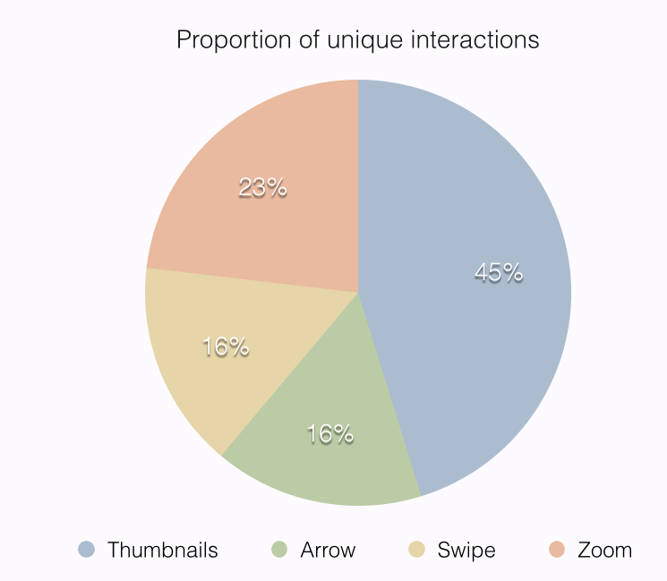
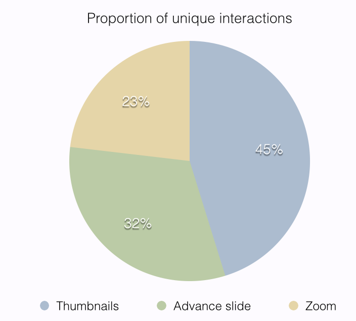
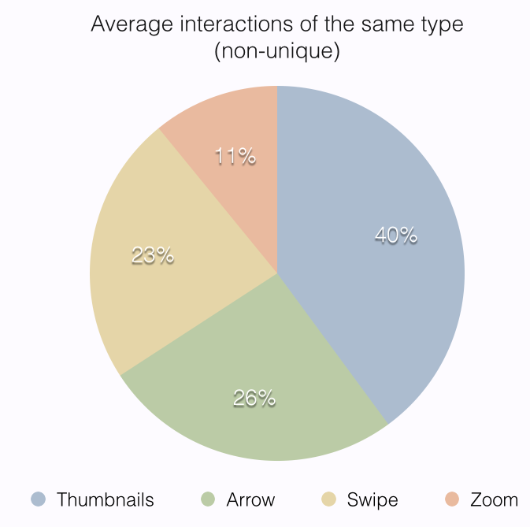
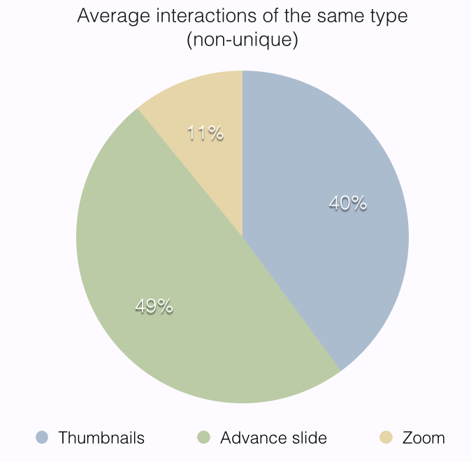
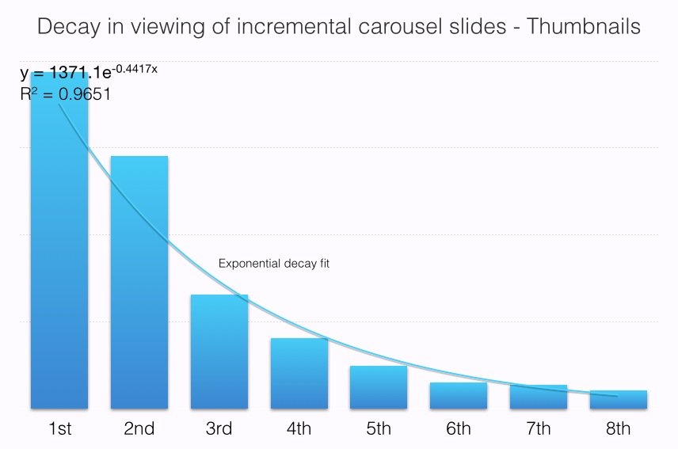
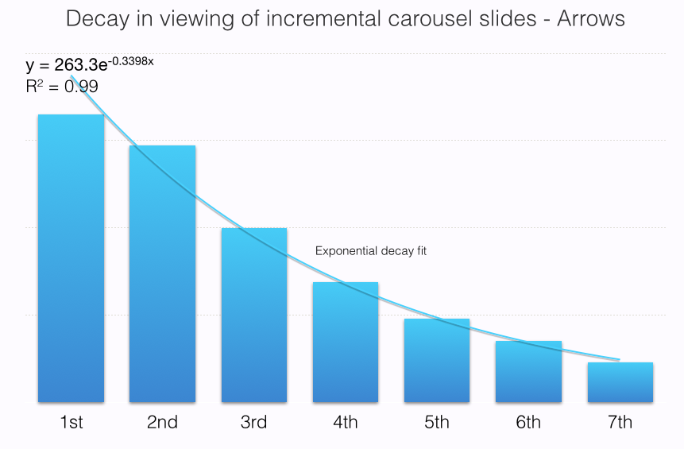
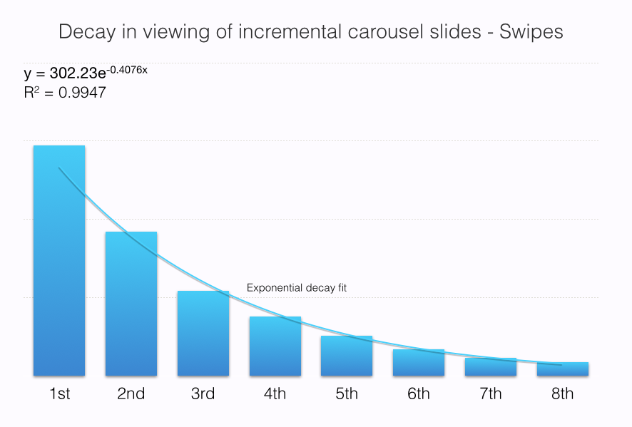
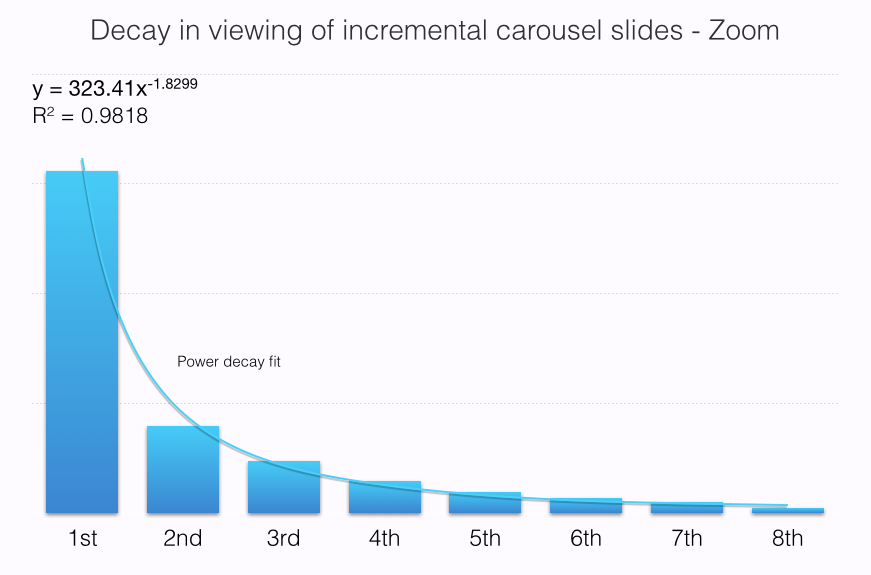

# You Should Use A Carousel

Carousels are now an anti-pattern. This all started when Erik Runyon posted a [fantastically detailed breakdown of carousel usage](http://weedygarden.net/2013/07/carousel-interaction-stats/) on ND.edu. On his site [shouldiuseacarousel.com](http://shouldiuseacarousel.com), Jared Smith firmly states that, given the choice, you should not use a carousel. Brad Frost echoes this sentiment in [his article entitled _Carousels_ on his blog](http://bradfrostweb.com/blog/post/carousels/). Luke Wroblewski joined in and suggested that the data available so far [is convincing enough to never use a carousel again](https://twitter.com/lukew/status/293857685546360834).

So I’ve been in a bit of a quandary. At Mobify, we develop large-scale e-commerce mobile websites. And, a lot of the time, those sites have at least one carousel on them. Are we doing something wrong? Are we doing our users a disservice? Could our sites be even better if we stopped using carousels? These were all questions my co-author Peter and I asked each other as we looked through the sites we develop. Instead of being reactionary and following these recommendations to a tee, Peter and I decided to do our own research.

## Why We Use Carousels

Carousels are much more than a method of displaying marketing information on a homepage. Because we focus on designing for mobile, one of our biggest concerns is making sure we’re balancing information density with small screens. That means making sure we’re always making the best possible use of horizontal and vertical screen real estate. We use carousels to maximize that information density and maintain user context without forcing the user to scroll further down the page.

Brad Frost refers to these types of carousels as [the overflow pattern](http://bradfrostweb.com/blog/post/the-overflow-pattern/). The reason I like carousels isn’t because they take advantage of more screen real estate when it’s available. I like them because they enable the user to keep a mental map of where they are on the site while saying “More of that, please.”

Context is integral for carousels. Our design team avoids carousels that don't provide context to the user. On a Product Detail Page, a user knows that swiping through the carousel will give them more product images. On a homepage marketing carousel, the user has little idea what the next slide will show.

## The Case Against Carousels

The current argument against carousels revolves around a few central points:

1. People don’t interact with carousels.
1. If people interact with carousels, they only interact with the first slide.
1. Carousels aren’t accessible.
1. Automatic advancement of carousel items is bad for users.

### Hypothesis One: People Don’t Interact With Carousels.

#### Argument

The argument here is usually centred around the data provided by [Erik Runyon on the ND.edu site](http://weedygarden.net/2013/07/carousel-interaction-stats/). This data shows that only 1.07% of visitors clicked on slides in the featured carousel. Viewing a slide was not enough to trigger an interaction. Users had to click directly on a slide to be counted.

**To dispute the hypothesis, the data will have to show that people interact with carousels at a much higher rate than 1.07%.**

#### Our Results

**Result: People interact with Product Image Gallery Carousels at a high rate. 72% of users advance the carousel at least once. 28% of users directly interact with the carousel by zooming.**

If you look at our [Unique Interaction data](#unique-interaction-rates) — and, for the closest comparison, Zoom Interactions — you can see that 28% of users interacted with the carousel by directly tapping on it for more information. If you consider advancing the carousel in any way to be an interaction, that data goes up to 72% of total users interacting with the carousel.

> For a complete breakdown of how we found these results, please read the [Findings section](#findings) of the article.

### Hypothesis Two: People Only Interact With The First Slide

#### Argument

Of the 1.07% that clicked Erik’s carousel, 89.1% clicked on the first slide. Again, if we assume carousels are effective, we’d expect those numbers to follow a reasonable trend down as we added more slides. Instead, Erik’s data shows that the slide in the second position only received 3.1% of all clicks. To put that in perspective, of the 3,755,297 visitors to ND.edu, only 1,234 visitors clicked on the second slide. Slides after the second one do show the fall off we would expect.

**To dispute the hypothesis, the data will have to show that users interact with the second slide at a much higher rate than 3.1%.**

#### Our Results

**Result: People directly interact with the second slide at a rate of 15.7%. At least 64% of people advance from the second slide to the third slide.**

The data shows that [users advance carousels at a rough linear rate](#interaction-decay-rates). Different control schemes had different results for likelihood of interaction. All showed that users had a high percentage of engaging with the next slide. At least 64% of users that interact with the first slide interact with the second slide.

The ND.edu data was explicitly looking at _clicks_ on slides to measure interaction. To ensure our data maps well, we should also look at direct interactions. For our carousels, that was the Zoom interaction. The data shows that of the 28% of users that zoomed our carousel, 54.1% zoomed on the first slide. The slide in the second position received 15.7% of all Zoom interactions.

This looks like Erik's data in that the first slide receives the majority of direct interactions. However, the decay in our data is much more reasonable than the ND.edu site's carousel. 45.9% of all direct interactions occur on slides after the first one. This means that nearly half of all direct interactions occur after the first slide.

> For a complete breakdown of how we found these results, please read the [Findings section](#findings) of the article.

### Carousels Aren’t Accessible

The next issue is bad but much more manageable. It’s not an argument about using carousels in general — it’s an argument against using them as they’re currently implemented. It’s not impossible for a carousel to be accessible but it does seem to be pretty rare. Certainly, our current carousel implementation was not designed with accessibility in mind.

This, I don’t think, is a fault of carousels in general but is a consideration for whether you should use one. Making [our carousel plugin](http://github.com/mobify/scooch) accessible is a top-of-the-list feature for our next version. It’s not part of the argument on carousel _effectiveness_ so we won’t deal with it here.

**Carousels, as they stand, are not accessible but there is no reason they can’t be in the future.**

### Automatic advancement of carousel items is bad for users.

The argument here is that, by auto-advancing carousel items, designers are creating an issue where users _want_ to click on their slides but are being thwarted by the interface. We whole heartedly agree with this point. If you’re going to use a carousel, you should definitely avoid using auto-advancement to show users additional slides. If you need further convincing, [check out this tweet from Brad Frost](https://twitter.com/brad_frost/status/514919131855224832).

For an excellent exploration of this issue, you should read the [Nielsen Norman Group’s article on Auto-Forwarding Carousels](http://www.nngroup.com/articles/auto-forwarding/). None of the carousels we design use auto-advancement.

If you have to use auto-advancement, turn it off the moment the user starts interacting with the carousel. There's little worse than clicking the wrong slide because the slide changed right as you clicked. On desktop, that means you should turn off auto-advancement as soon as the mouse hovers over the carousel. On mobile, that means you should turn off auto-advancement as soon as you register an active touch on the carousel.

**Auto advancement is bad. If you use a carousel, do not use auto-advancement.**

## Findings

> Caution: This part of the article is a little dry. It outlines how we did our research and goes into way more detail on the data. If that sounds interesting, please read on. If not, maybe you want to [skip to the next section](#considerations).

To dispute the hypotheses that we laid out above, the data needed to address two points:

1. Frequency of interaction with the carousel
1. Frequency of interaction with slides after the first one

### Defining Interaction

There are four ways to interact with the carousels that we tracked during this experiment (also shown in the figure below).

1. The first is to use the **Swipe** gesture on a smartphone touch screen to swipe left or right.
1. The second is to use an in-slide **Arrow** button to advance or reverse the carousel by one image.
1. The third way to interact is by tapping **Thumbnails** at the bottom of the carousel.
1. The fourth interaction type is to tap on the slide to **Zoom** the current image in the carousel into a full screen takeover view.

To map our data to the ND.edu data, we will consider the fourth type of interaction — Zoom — to be equal to ‘clicking on a feature’. In both cases, the user is engaging with the carousel slide and requesting more information.

Another important thing to note is that we only consider deliberate interactions as interactions. Touchstarts or touchmoves won’t trigger an interaction. Accidental swipes that don’t result in a slide advancement also won’t trigger an interaction.

### Research Methods and Context

The data used in this analysis came from several mid to large eCommerce websites over a period of 11 months. During this time, we sampled approximately 7.5 million carousel interaction events. Following [our privacy policy](http://www.mobify.com/privacy/), we retained no individually identifiable information.

### Results

#### Unique Interaction Rates

The first statistic that interested us was how often mobile users interacted with the carousel. We’ll measure that by looking at _unique interactions_.

A unique interaction is the first interaction of any given type with the carousel content or controls by a user. If you tapped five thumbnails, we would only count it as one unique interaction. We’ll investigate non-unique interactions in more detail below.

The data shows that around 72% of visitors to the page interacted in some way with the carousel. Thumbnails were the clear front-runner for interactions. 55% of visitors clicked at least one thumbnail.

##### Proportion of Unique Interactions

Our data shows that the thumbnail controls were the most popular way to interact with the carousel. In fact, it was almost twice as popular as each of the other interaction methods and more popular than Arrow and Swipe interactions combined.

Zoom is the second most popular interaction type. Zoom is similar to swipe in that it has the largest trigger area of any of the interactions — you can tap anywhere on the carousel to trigger it. We have to assume that some of the zoom interactions we encountered were unintentional mistaps. That said, the level of engagement with zoom was still high — higher than it would be if it was just accidental. Almost 28% of all visitors interact with the zoom functionality.

Swipe is the least popular way for users to interact with the carousel. This strongly advocates for ensuring you have provided an explicitly visible control system for interactions.

Both Arrow and Swipe interactions are implying the same carousel action: advancing to the next slide.  If we combine Arrow and Swipe, the interaction rate is very similar to the Thumbnail interaction rate.

#### Total Interaction Rates

In total, there were 2.4 interactions on average per carousel impression. This shows that for the 72% of visitors who did interact with the carousel, interacting with it many times was the norm.

##### Average number of interactions of the same type (non-unique)

Users who interacted with thumbnails did it way more often than any other control system on the carousel. On average, a user would interact with 6 thumbnails when they used the carousel. Swipe and Arrows both had similar numbers of average interactions — 3.5 and 3.9 on average. The low number of interactions with zoom shows us that users are only zooming on product pictures with a high level of interest.

Thumbnail users having the highest average number of interactions shows that they are significantly more engaged than Arrow or Swipe users. It may be interesting to explore how this level of engagement results in additional micro-conversions such as adding to cart.

If we combine Arrow and Swipe interactions, similar to how we analyzed the unique interaction data, _slide advancement_ is revealed as the most popular carousel interaction activity.

#### Interaction Decay Rates

Using the data we collected, we were able to model the likelihood for a user to interact again after each interaction. In the case of _slide advancement_, that means advancing from the second to the third image after they had advanced from the first to the second. In the case of _direct interaction_, that means users tapping zoom on each slide after the first one.

We modeled this for each of the different interaction methods: Thumbnail, Arrows, Swipe, and Zoom.

##### Thumbnails

For each thumbnail viewed, there was roughly a 69% chance for the user to view the next thumbnail. A more precise fit can be achieved using an exponential decay rate, shown in the figure. Even though it was possible for the user to view thumbnails in any order, most thumbnail users viewed the images in the carousel in sequential order.

##### Arrows

For each arrow tapped, we find a rough linear relationship with a more precise exponential model. In the linear relationship, there is roughly a 76% chance that the user will click the arrow again to view the next slide.

##### Swipe

Swipe decay can be modeled linearly at a 64% chance that the user would swipe again. A more accurate exponential model is shown in the figure below.

##### Zoom

Zoom interaction decay rates follow a power law and a linear approach would be a very poor approximation.  An r^2 of nearly .98 indicates an excellent fit.

## Considerations

### Mobile Interactions vs Desktop Interactions

Our carousel was only on mobile devices. The carousel on ND.edu was only on desktop devices. There is a chance that mobile users are more likely to interact with carousels than desktop users. This could be due to the ease-of-interaction with swipe or controls versus smaller control target sizes with a mouse. It may also be a more natural pattern on a mobile device.

### Carousel Success Criteria

The success criteria of the carousels measured here and the carousels measured by Erik are different. The success criteria for Erik’s carousels revolves around having users click through to the content offered by the slide. The success criteria for our carousels is to have the user navigate to the next slide and see all the images.

There is a much higher barrier to entry for users on a carousel that requires them to click to navigate to a new page. That may be responsible for why the interaction rate is much lower on the ND.edu carousel as compared to the one we measured here.

### Marketing Carousels vs Image Carousels

There is definitely a major issue with comparing our findings to Erik’s data from ND.edu. The type of carousel we’re using is different. I don’t think this presents much of a problem to our findings. While the two types of carousels may not be visually related, our findings show that the underlying pattern is successful. Our goal with this study was to determine whether the idea of a horizontally scrolling multi-slide content display was flawed. The data suggests it is not. Instead of the root problem for ND.edu being carousels in general, it seems more likely to be a problem with design.

Users may be exhibiting banner blindness when it comes to marketing carousels. Marketing carousels may also not be providing relevant information to users. There are so many reasons why marketing banner carousels could be ineffective that it is unreasonable to suggest the UI pattern itself is the issue. We do sometimes use marketing carousels on our sites. It would be an interesting follow up to this article to see how our data on those compares with the ND.edu findings.

### University Site vs E-Commerce Site

Another limitation of comparing our findings to the ND.edu findings is that the two user contexts may be so different that comparing them is impossible. The goal of a user on an e-commerce site is to discover information about products to make a purchasing decision. The goal of a user on an educational site is to learn more or find specific information about the university.

## Steps for the Future

This data opened my eyes to how much research that is still needed on carousels. There are some steps I would love to take or see other people take in the future:

1. We would like to do similar studies on different types of carousels. It would be interesting to see if our marketing banner carousels perform at similar rates to Erik Runyon’s data.
1. It would be interesting to measure how interacting with a carousel affects a user’s actions further down the line. If they interact with a Product Image Gallery, are they more or less likely to Add to Cart?
1. I would love to see if there was a good way to measure the likelihood of carousel interaction between mobile, tablet, and desktop. We unfortunately don’t build desktop sites so that data is less accessible to us. It would help to be able to do direct comparisons instead of extrapolating from the data available.
1. The data showed that Swipe is one of the least used interaction types. I have a theory that Swipe interactions get cannibalized by other interaction types. My thought here is that Swipe is still an unexpected method of interaction on the web. By presenting extra controls, users have an obvious way to interact with the carousel so they are more likely to choose that method. It would be interesting to see if removing other control schemes caused Swipe interactions to go up.

## Conclusion

We started this article out by going over why and how Mobify uses carousels on the sites we build. There’s a large difference between different kinds of carousels. We find a compelling use for them in presenting extra contextual information without having to force the user to scroll.

Most of the data that exists so far on carousels is based on marketing banner carousels. This data argues that interactions with carousel content are quite low — on the order of 1.07%. It also suggests that the chance of users advancing the carousel and interacting with the next slide is _extremely_ low. The data also raised some valid points about carousels in general. They aren’t accessible and auto-advancement is bad.

Our research found little in common with the data presented by Erik Runyon on ND.edu. Users interacted with our carousels at a high rate. They also interacted with additional slides at a rate that was much higher than the ND.edu data suggested. I think there are some pretty good reasons for these discrepancies that we discussed in the Considerations section. They’re definitely _very_ different carousels with _very_ different goals. For me, that’s the biggest conclusion to take away from this whole article.

Carousels come in many shapes and sizes. Some of them can be effective. Others can be ineffective. We need lots more data from lots of different situations to be able to dismiss the pattern entirely. As with most design patterns, if you ask yourself ‘Should I use a carousel?’, the answer is: If it’s right for your users.
